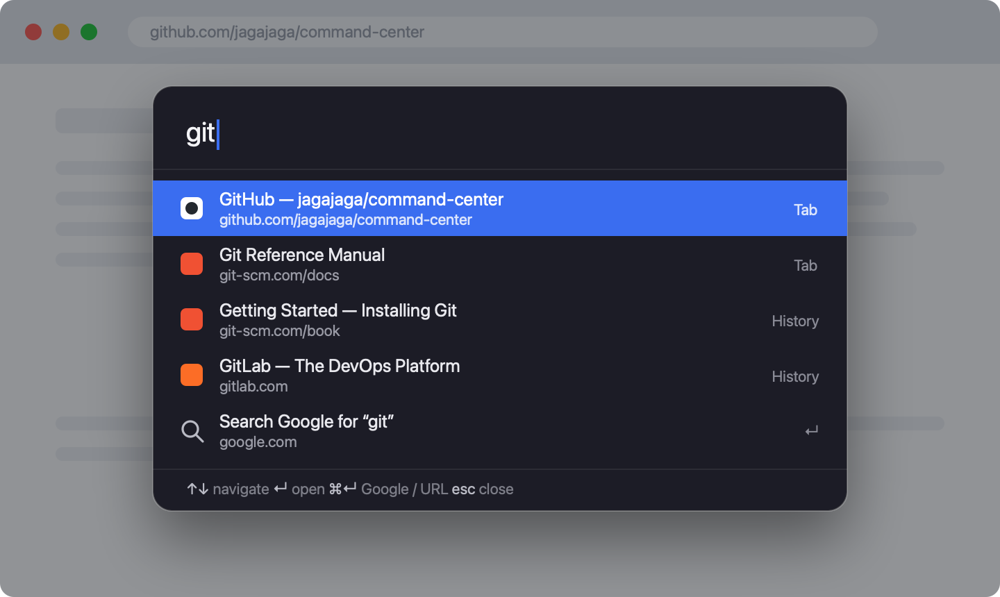

# Command Center

> A Spotlight/Alfred-style command palette for Firefox. Press **Cmd+Shift+M**,
> fuzzy-search your open tabs and history, and jump — or hit **Cmd+Enter** to
> Google-search or open a URL.

[](https://addons.mozilla.org/firefox/addon/command-center/)
[](https://addons.mozilla.org/firefox/addon/command-center/)
[](https://addons.mozilla.org/firefox/addon/command-center/)
[](https://github.com/jagajaga/command-center/actions/workflows/ci.yml)
[](https://github.com/jagajaga/command-center/releases/latest)
[](LICENSE)



## Install

- **[Firefox Add-ons (recommended)](https://addons.mozilla.org/firefox/addon/command-center/)** —
  one-click install with automatic updates. *(Goes live once Mozilla approves
  the first release.)*
- **[Latest GitHub release](https://github.com/jagajaga/command-center/releases/latest)** —
  download the signed `.xpi` and drag it onto a Firefox window (or `about:addons`
  → ⚙️ → **Install Add-on From File…**). The Mozilla-signed build is attached to
  each release once that version has been signed.

Then press **Cmd+Shift+M** on any normal web page.

> Building from source? See [Development](#development) for loading it
> temporarily without signing.

## Usage

| Keys | Action |
|------|--------|
| **Cmd+Shift+M** (`Ctrl+Shift+M` on Win/Linux) | Open / close the palette |
| *type* | Fuzzy-search open **tabs** first, then **history** |
| **↑ / ↓** (or `Ctrl+P` / `Ctrl+N`) | Move selection |
| **Enter** | Switch to the tab, or open the history/URL result in a new tab |
| **Cmd+Enter** | Ignore the list — open what you typed as a URL, else Google it |
| **Esc** / click outside | Close |

Looks-like-a-URL detection covers `example.com`, `localhost:3000`,
`https://…`; anything else becomes a Google search.

## Features

- ⚡ **Tabs-first fuzzy ranking** — a subsequence scorer with bonuses for
  consecutive matches and word/segment boundaries, so `gcc` finds
  `github.com/.../command-center`.
- 🔎 **History fallback**, de-duplicated against your open tabs.
- 🌐 **Site icons** next to every result.
- 🎯 **Cmd+Enter** to go straight to a Google search or URL.
- 🛡️ **Isolated overlay** — rendered in a Shadow DOM and grabs keystrokes at the
  `window` capture level, so the underlying page's shortcuts (e.g. GitHub's
  single-key hotkeys) never fire while it's open.

## Permissions & privacy

| Permission | Why |
|------------|-----|
| `tabs` | List and switch between your open tabs |
| `history` | Search your browsing history |
| `<all_urls>` (content script) | Draw the overlay on any page |
| `https://icons.duckduckgo.com/*` | Fetch favicons |

Favicons are fetched in the background from DuckDuckGo and rendered as `data:`
URLs (so they work even on strict-CSP sites). This means the **hostnames** of
your results are sent to DuckDuckGo. Nothing else leaves your machine — no
analytics, no accounts. To disable it, remove the `icons.duckduckgo.com`
permission from `manifest.json`; results fall back to a globe glyph.

## How it works

| File | Role |
|------|------|
| `manifest.json` | Permissions, the Cmd+Shift+M command, content-script registration |
| `background.js` | Privileged `tabs`/`history` APIs, tab switching/opening, favicon fetch + cache, relays the command to the active tab |
| `content.js` | Shadow-DOM overlay, fuzzy ranking, keyboard handling, rendering |
| `icon.svg` | Toolbar / add-on icon |

The keyboard shortcut isn't a built-in Firefox combo, so it should bind on
install. To change it: `about:addons` → gear ⚙️ → **Manage Extension Shortcuts**.

> The overlay can't be injected on privileged pages Firefox blocks extensions
> from (`about:*`, `addons.mozilla.org`, `view-source:`, the PDF viewer). The
> toolbar button is a backup trigger.

## Development

```sh
# Lint (same check CI runs)
npx web-ext lint --source-dir . --self-hosted \
  --ignore-files ".github/**" "docs/**" "*.md" "LICENSE"

# Run in a scratch Firefox profile with live reload
npx web-ext run --source-dir .
```

Or load it manually for a one-off test: `about:debugging#/runtime/this-firefox`
→ **Load Temporary Add-on…** → pick `manifest.json` (removed when Firefox
restarts, no signing needed).

## Releasing

Releases are automated by [`.github/workflows/release.yml`](.github/workflows/release.yml).
To cut one:

1. Bump `version` in `manifest.json` (AMO rejects a re-used version).
2. Commit, then tag and push:
   ```sh
   git tag v1.2.3 && git push origin v1.2.3
   ```

CI then lints, submits the version to Firefox Add-ons for review (listed
channel), and publishes a GitHub Release with auto-generated notes and a source
zip. Signing uses the `AMO_JWT_ISSUER` / `AMO_JWT_SECRET` repository secrets.

## License

[MIT](LICENSE) © jagajaga
